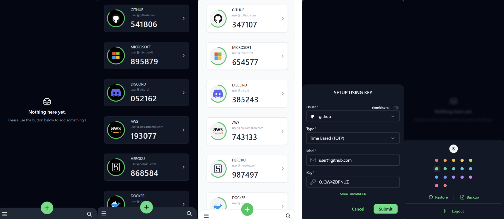

<div align="center">
  
</div>
<h1 align="center">MyAuthenticator</h1>

<p align="center">A serverless web application that generates TOTP and HOTP codes, enabling robust two-factor authentication (2FA) directly within your browser.
</p>
<div align="center">
	
[](https://nuxt.com)
[](https://pages.cloudflare.com)
[](https://www.typescriptlang.org)
[](https://drizzle.com)
[](https://tailwindcss.com)

</div>

## Live Demo

See the live demo:

[](https://my-authenticator.pages.dev)

- Credentials: `admin` - `Admin@123$`

## Features 🔥

🚀 **Serverless:** Leverages complete edge support, eliminating the need to maintain a server. You can deploy this project on your Cloudflare account for _`Free`_.

⚙️ **Compatibility:** MyAuthenticator supports `TOTP` (Time-Based One-Time Password) and `HOTP` (HMAC-Based One-Time Password), which are widely used by most services for two-factor authentication.

☀️ **Theming:** Offers light and dark themes, with customizable accent colors.

💫 **Icons:** Includes 100+ colored icons and access to 3000+ icons from [SimpleIcons](https://simpleicons.org/), all are in `SVG` format for scalability.

🔐 **Secure:** Uses `nuxt-auth-utils` for authentication and encrypts database fields for enhanced security.

🗃️ **Backup / Restore:** Securely backup and restore authenticators with encryption. Supports import from and export to `Google Authenticator`.

🤖 **Telegram Bot and MiniApp:** You can use this web app as a Telegram miniapp within the Telegram app.

## Screenshots 📱



## Environment Variables

```sh
# required
NUXT_SESSION_PASSWORD="your-super-long-secret-for-session-encryption"
NUXT_AUTH_USERNAME="admin"
NUXT_AUTH_PASSWORD="Admin@123$"

# optional
NUXT_DB_ENCRYPTION_PASSWORD="your-super-long-secret-for-db-encryption"
NUXT_TELEGRAM_BOT_TOKEN="12345678:AAEzFGO9ME4i7hV9gfPTgAcJABCDEFG"
NUXT_TELEGRAM_USERID="874962691"
```

### Required Variables

- `NUXT_SESSION_PASSWORD`: This password is used by `nuxt-auth-utils` to secure your session. It must be at least 32 characters long.

- `NUXT_AUTH_USERNAME`: The username for authentication. It must be at least 5 characters long.

- `NUXT_AUTH_PASSWORD`: The password for authentication. It must be at least 8 characters long and include:
  - One uppercase letter
  - One digit
  - One lowercase letter
  - Two special characters

### Optional Variables

- `NUXT_DB_ENCRYPTION_PASSWORD`: This password is used to encrypt and decrypt the database field of `secretkey`. By default, no encryption is used for data stored in the database. You can enable encryption by setting this variable. It must be exactly 32 characters long.

- `NUXT_TELEGRAM_BOT_TOKEN`: This is the Bot Token for the Telegram Bot, which can be obtained from [@BotFather](https://telegram.dog/BotFather). Required for using this web app as a Telegram miniapp.

- `NUXT_TELEGRAM_USERID`: This is your Telegram User ID used to identify you as a user of the bot. Obtain it from [@MissRose_bot](https://telegram.dog/MissRose_bot) using the `/info` command. Required for using this web app as a Telegram miniapp.

## Deploy 🚀

[](https://hub.nuxt.com/new?repo=IAMSDR/MyAuthenticator)

> [!NOTE]
> This project is currently under testing and improvements. Please back up your data before proceeding.

You can deploy this project on your Cloudflare account for free and with zero configuration using [NuxtHub](https://hub.nuxt.com)
You can use either the NuxtHub CLI or the NuxtHub Admin Web UI.

### Using NuxtHub CLI

- First, clone this repository.

- Follow this [guide](https://hub.nuxt.com/docs/getting-started/deploy) and create `.env` file and add necessary environment variables

```bash
npx nuxthub deploy
```

- Once you deployed your project, apply migrations in production with:

```bash
npx nuxi dev --remote
```

- That's it, you've created your own authenticator.

- You can set up your Telegram bot at https://< yourapp >.pages.dev/telegram

### Using NuxtHub Web UI

- First, fork this repository.
- Open the [NuxtHub Admin](https://admin.hub.nuxt.com/)
- Click on `New Project` then Import a `GitHub repository`
- Select your Github repository
- Click on `Import repository`
- Add the necessary environment variables
- After deploying, go to your project dashboard and create a table in the database by running the following SQL query in the `SQL runner`:

```sql
CREATE TABLE `accounts` (
	`id` integer PRIMARY KEY AUTOINCREMENT NOT NULL,
	`type` text NOT NULL,
	`issuer` text NOT NULL,
	`label` text NOT NULL,
	`secret` text NOT NULL,
	`algorithm` text NOT NULL,
	`digits` integer NOT NULL,
	`period` integer NOT NULL,
	`counter` integer NOT NULL,
	`icon` text NOT NULL,
	`icontype` text NOT NULL,
	`createdAt` text DEFAULT (current_timestamp) NOT NULL
);
```

- That's it, you've created your own authenticator.
- You can set up your Telegram bot at https://< yourapp >.pages.dev/telegram

## Contributing and Suggestions

Feel free to contribute to this project with your ideas and improvements. Your feedback and suggestions are highly valued and will help enhance this project further.

## License

MyAuthenticator is Free Software: You can use, study share and improve it at your
will. Specifically you can redistribute and/or modify it under the terms of the
[GNU Affero General Public License](https://www.gnu.org/licenses/agpl-3.0.en.html) as
published by the Free Software Foundation, either version 3 of the License, or
(at your option) any later version.
